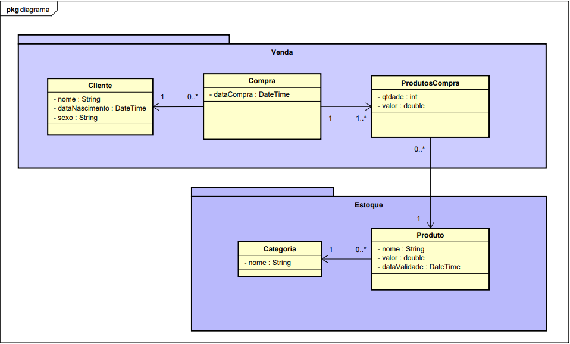

<h1>Sobre a API</h1>

Essa API está sendo desenvolvida apenas para facilitar o aprendizado sobre requisições.
A versão 1.0 contém apenas a Classe categoria. segue o diagrama de classe:

<h2>Como iniciar a API</h2>

Para inicialização da API baixe o DOCKER. <a>https://www.docker.com/</a>.

Após isso acesse o diretório raiz do projeto (diretório que contém o arquivo Compose.yaml) e execute o comando <b>docker compose up</b>. Após isso espere a API inicializar e ela já estará disponível para uso.
 

<h2>End-Points</h2>

Os endpoints são a forma de uma API disponibilizar dados para outros sistemas. Isso ocorre com o auxilio dos protocolos <b>HTTP</b>, caso você ainda não saiba do que se trata, busque saber!

Obs.: Na frente de cada endpoint estará o metodo HTTP correspondente</p.>

Lista de EndPoints sobre <b>CATEGORIA</b>:

<ul>
    <li>GET http://localhost:8080/api/Categoria/getTodos</li>
        <ul> <li>Retorna todas as categorias cadastradas.</li> </ul>
    <li>GET http://localhost:8080/api/Categoria/getUmaCategoria/{id}</li>
        <ul> <li>Retorna a categoria com o id informado, caso exista.</li> </ul>
    <li>POST http://localhost:8080/api/Categoria/adicionar</li>
        <ul> 
            <li>Retorna a categoria criada.</li>
            <li> O corpo da mensagem deve ser o seguinte: <code>
             { "nome" : "Nome qualquer"}
            </code> </li>
        </ul>

</ul>